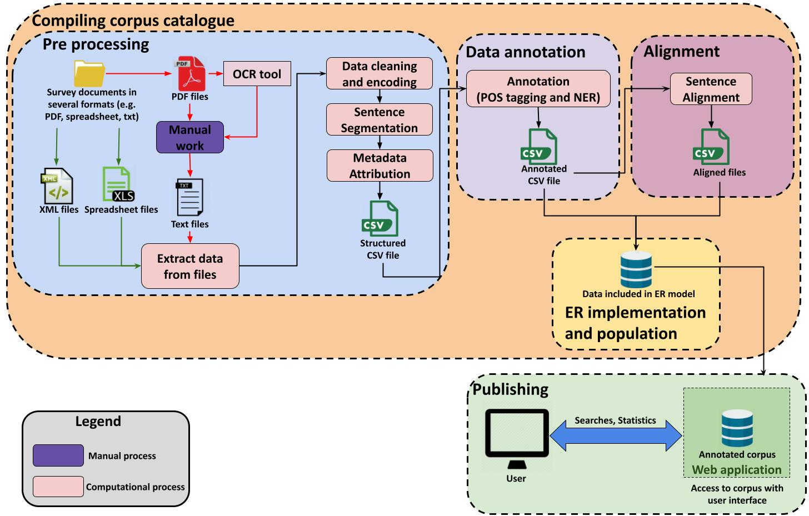

# Multilingual Corpus of Survey Questionnaires (MCSQ) Compiling

The Multilingual Corpus of Survey Questionnaires (MCSQ) is the first publicly available corpus of survey questionnaires, comprising survey items from large-scale comparative survey projects that provide cross-national and cross-cultural data to the Social Sciences and Humanities.
Namely, the European Social Survey (ESS)S[1](#ess) (rounds 1 to 9), the European Values Study (EVS)[2](#evs) (waves 2, 3, 4 and 5), the Survey of Health Ageing and Retirement in Europe (SHARE)[3](#share) (waves 7, 8 and COVID questionnaires) and, the Wage Indicator [4](#wis) (wave 1 and COVID questionnaires). 
The questionnaires are available in the English (from Great Britain) source language and their translations into Catalan, Czech, French, German, Norwegian, Portuguese, Spanish  and Russian, adding to 30 language-country combinations. Additionaly, some English questionnaires are available with localizations for Ireland and Malta.

This repository contains the scripts that were used in the compilation steps of the MCSQ, which was implemented as a Entity-Relationship (ER) database.
In the preprocessing directory there are scripts to preprocess data. It is important to notice that the scripts differ concerning the format of the input source file and the survey project.
In the DB directory there are the files concerning the database structure.
Alignment folder has the scripts to align a given target questionnaire in respect to its source using an heuristic that leverages metadata information.
Finally, the annotation folder has the scripts that call the annotation methods.
The Figure below depicts the framework applied to compile and publish the MCSQ.

The [MCSQ]: Multilingual Corpus of Survey Questionnaires is an open-access research resource. 
If you use part of the code, datasets, and/or findings to inspire your own scientific work, please cite the article:

Zavala-Rojas, D., Sorato, D., Hareide, L., & Hofland, K. (forthcoming 2021). [MCSQ] Multilingual Corpus of Survey Questionnaires. Meta: Journal Des Traducteurs.
@article{Zavala-Rojas,author = {Zavala-Rojas, Diana and Sorato, Danielly and Hareide, Lidun and Hofland, Knut},journal = {Meta: Journal des traducteurs},title = {{[MCSQ] Multilingual Corpus of Survey Questionnaires}}}

* Visit the MCSQ official website https://www.upf.edu/web/mcsq/
* MCSQ interface prototype http://easy.mcsq.upf.edu/
* For more implementation details, see code documentation in: https://mcsq-compiling.readthedocs.io/en/latest/

The MCSQ was developed in the Social Sciences and Humanities Open Cloud (SSHOC)[5](#sshoc) project. SSHOC has received funding from the European Union's Horizon 2020 project call H2020-INFRAEOSC-04-2018, grant agreement #823782.

<a name="ess">1</a>: https://www.europeansocialsurvey.org/
<a name="evs">2</a>: https://europeanvaluesstudy.eu/
<a name="share">3</a>: http://www.share-project.org/home0.html
<a name="wis">4</a>: https://wageindicator.org/Wageindicatorfoundation/researchlab/wageindicator-survey-and-data
<a name="sshoc">5</a>: https://sshopencloud.eu/